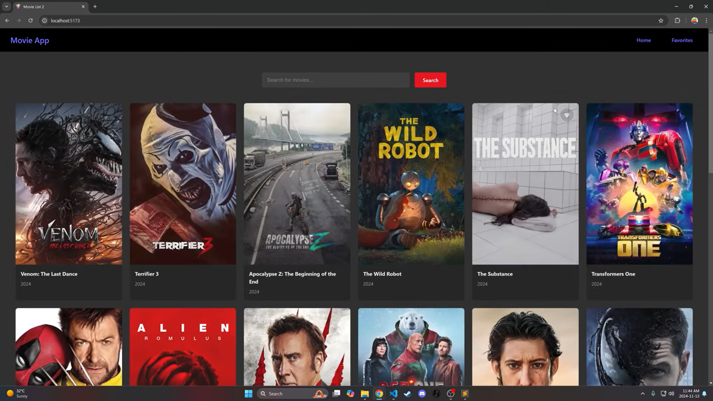
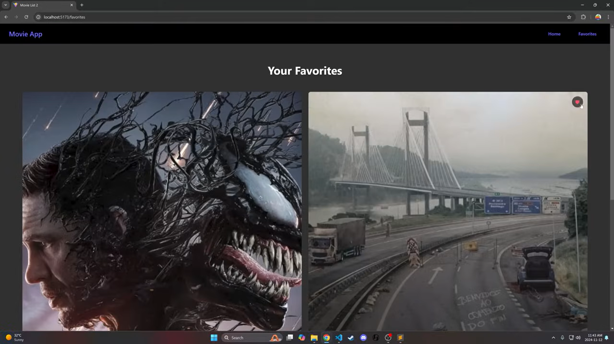

# Cinemate – Movie Streaming Web App

Cinemate is a responsive and modern movie streaming website built using HTML, CSS, ReactJS, and the TMDb (The Movie Database) API. It allows users to browse movies, search for specific titles, view details, and maintain a list of favourites.

---

## Features

- Search for movies by title
- Browse popular, trending, and upcoming movies
- View detailed information about each movie
- Add or remove movies from a favourites list
- Responsive layout suitable for desktop, tablet, and mobile

---

## Screenshots

| Home Page | Favourites |
|-----------|------------|
|  |  |

---

## Technologies Used

- ReactJS
- HTML5
- CSS3
- TMDb API

---
